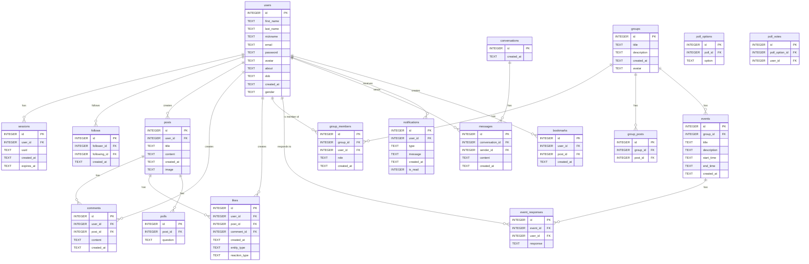

# Social Network

This is a full-featured social network application built with a Go backend and a Next.js frontend. It includes user authentication, profiles, posts, comments, real-time chat, groups, events, and more.

## Live Demo

[Link to Live Demo]

## Features

### Backend (Go)

*   **User Authentication:** Secure user registration and login with session management.
*   **User Profiles:** Customizable user profiles with avatars, bios, and personal information.
*   **Social Graph:** Follow and unfollow other users.
*   **Posts:** Create, edit, and delete posts.
*   **Comments:** Comment on posts in real-time.
*   **Likes:** Like posts and comments.
*   **Groups:** Create and manage user groups, with group-specific posts and events.
*   **Events:** Create and manage events, with RSVPs.
*   **Real-time Chat:** One-on-one and group chat with websockets.
*   **Notifications:** Real-time notifications for likes, comments, follows, and other activities.
*   **Polls:** Create and vote on polls within posts.
*   **Bookmarks:** Bookmark posts for later viewing.
*   **Image Uploads:** Upload and store images for profile avatars and post content.

### Frontend (Next.js)

*   **User-friendly Interface:** A modern and responsive UI built with Next.js and Material-UI.
*   **Feed:** A personalized feed of posts from users you follow.
*   **Discover:** Discover new posts and users.
*   **Activity:** View your recent activity, including likes, comments, and follows.
*   **Real-time Updates:** Real-time updates for new posts, comments, and notifications.
*   **Chat:** A dedicated chat interface with one-on-one and group conversations.
*   **Groups:** Browse, join, and create groups.
*   **Events:** View and manage events.
*   **User Profiles:** View and edit your profile, and view other users' profiles.
*   **Search:** Search for users, posts, and groups.
*   **Authentication:** Login and registration pages.
*   **Error Handling:** Graceful error handling and error pages.

## Tech Stack

*   **Backend:** Go, SQLite, Gorilla WebSocket
*   **Frontend:** Next.js, React, TypeScript, Material-UI, SWR
*   **DevOps:** Docker, Docker Compose

## Directory Structure

```
.
├── Backend
│   ├── Database.go
│   ├── Dockerfile
│   ├── Server.go
│   ├── go.mod
│   ├── go.sum
│   ├── handlers
│   ├── main
│   ├── main.go
│   ├── middleware
│   ├── mockdata
│   ├── models
│   ├── pkg
│   ├── services
│   ├── uploads
│   ├── utils
│   └── websocket
├── Frontend
│   ├── Dockerfile
│   ├── README.md
│   ├── app
│   ├── components
│   ├── context
│   ├── hooks
│   ├── lib
│   ├── next-env.d.ts
│   ├── next.config.ts
│   ├── package-lock.json
│   ├── package.json
│   ├── postcss.config.mjs
│   ├── public
│   ├── tsconfig.json
│   └── utils
├── LICENSE.md
├── README.md
├── build.sh
├── docker-compose.yml
└── run.sh
```

## Database Schema (ERD)



## Getting Started

To get a local copy up and running, follow these simple steps.

### Prerequisites

*   Docker
*   Docker Compose

### Installation

1.  Clone the repo
    ```sh
    git clone https://github.com/your_username/social-network.git
    ```
2.  Build and run the application with Docker Compose.
    ```sh
    ./build.sh
    ./run.sh
    ```
    The frontend will be available at `http://localhost:3000` and the backend at `http://localhost:8080`.

## Usage

Once the application is running, you can:

1.  Register a new user account.
2.  Log in with your new account.
3.  Create a profile.
4.  Start creating posts, following other users, and interacting with the community.

## Screenshots

*Note: I am unable to generate images. Please replace the placeholders below with actual screenshots of your application.*

**[SCREENSHOT_OF_HOMEPAGE]**
*Homepage*

**[SCREENSHOT_OF_PROFILE_PAGE]**
*User Profile*

**[SCREENSHOT_OF_CHAT]**
*Real-time Chat*

## Authors

*   **[Your Name]** - *[Your Role]* - [your-email@example.com]

## License

Distributed under the MIT License. See `LICENSE.md` for more information.