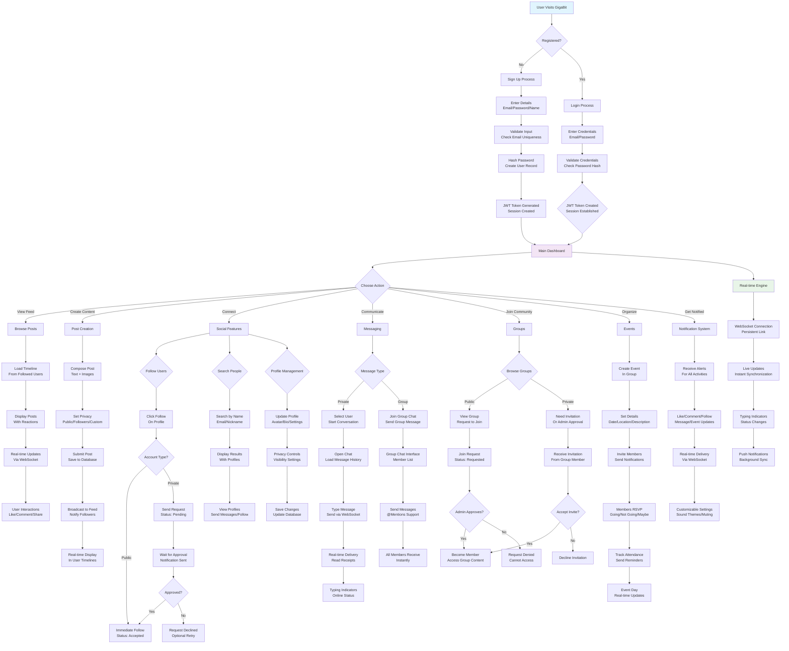

# GigaBit 🌐

[](https://golang.org/)
[](https://www.docker.com/)
[](LICENSE.md)
[](https://www.sqlite.org/)
[](https://developer.mozilla.org/en-US/docs/Web/API/WebSockets_API)
[](https://nextjs.org/)
[](https://reactjs.org/)
[](https://www.typescriptlang.org/)
[](https://tailwindcss.com/)
[](https://www.framer.com/motion/)
[](https://github.com/gorilla/mux)
[](https://github.com/gorilla/websocket)

<p align="center">
  
</p>

Hey there! 👋 Welcome to **GigaBit** - a real-time social networking platform we built to make online connections feel more natural. It's like social media but without all the noise - instant messaging, community groups, and privacy controls that actually work.

We built this with modern web technologies to create something that feels responsive and alive. Whether you're catching up with friends, joining niche communities, or just sharing what's on your mind, GigaBit keeps things simple and real-time.

## 📸 Screenshots

### Main Feed & Posts

_The heart of GigaBit - your personalized feed with posts from people you follow_

### Real-time Chat

_Private messaging that feels instant, with typing indicators and read receipts_

### Group Communities

_Dedicated spaces for communities with their own posts, events, and discussions_

### Event Management

_Easy event scheduling with RSVP tracking and automated reminders_

## 📋 Table of Contents

- [✨ What Makes GigaBit Special](#-what-makes-gigabit-special)
- [🛠️ Tech Stack](#️-tech-stack)
- [🏗️ Architecture & Data Flow](#️-architecture--data-flow)
- [🗄️ Database Schema & Logic](#-database-schema--logic)
- [🚀 Getting Started](#-getting-started)
- [📖 How GigaBit Works](#-how-gigabit-works)
- [🔌 Real-time Features](#-real-time-features)
- [📁 Project Structure](#-project-structure)
- [🔒 Security Features](#-security-features)
- [🤝 Contributing](#-contributing)
- [📄 License](#-license)
- [👥 Authors](#-authors)
- [🙏 Acknowledgments](#-acknowledgments)

## ✨ What Makes GigaBit Special

### 🔐 Simple But Secure Login
Getting started is easy - just pick a username and add your email. We use proper JWT tokens and bcrypt password hashing so your account stays secure. Sessions refresh automatically so you don't get logged out at annoying times.

### 🤝 Social Features That Work Like You Expect
**Following with Approval**
Public accounts let anyone follow immediately. Private accounts require approval first. When someone wants to follow you, you get a notification and can accept or decline. No unwanted followers.

**Finding People**
Search by name, email, or nickname to find specific people. We also suggest connections based on mutual friends. It's straightforward - no complicated algorithms.

**Profile Customization**
Add a nickname, bio, avatar, and personal details. Control who sees your birthday and gender. Your profile, your rules.

### 📝 Creating & Sharing Content
**Posting Made Simple**
Write posts with text and photos. Choose who sees each post - everyone, just your followers, or specific people. We made it flexible so you can share exactly how you want.

**Comments & Discussions**
Comments can have images too, and you can reply to replies for threaded conversations. Like posts and comments to show you care. It's like having mini-forums on every post.

**Polls for Fun & Decisions**
Make polls with multiple options and set when they expire. Results update live as people vote. Great for quick opinions or group decisions.

**Sharing & Saving**
Share posts to your feed or send them in messages. Bookmark stuff you want to find later. Content moves around the platform naturally.

### 💬 Chat & Messaging
**Private Messages**
Talk one-on-one with anyone. Messages arrive instantly, you see when people are typing, and get read receipts. It feels just like texting but with more features.

**Group Conversations**
Chat with multiple people at once. Perfect for communities or friend groups. Everyone sees messages in real-time, same features as private chats.

**Managing Your Chats**
Keep your chat history organized. Delete messages if you change your mind, archive old conversations, and scroll through thousands of messages quickly.

### 👥 Groups & Communities
**Building Communities**
Make groups for any interest - public ones anyone can join, or private ones that need approval. Each group gets its own space with posts, events, and chat rooms.

**Who Can Do What**
Group creators and admins manage everything. Members have different permissions based on their role. You control who can post, create events, or send messages.

**Group-Only Stuff**
Groups have their own content - posts, polls, and events that only members see. Everyone gets notified when something happens in their groups.

**Getting People In**
Private groups need admin approval to join. You can invite specific people or let them request to join. Admins decide who gets in.

### 📅 Events & Meetups
**Planning Events**
Set up events with all the details - what, when, where. Make them for your groups or just for yourself. It's straightforward to get people together.

**RSVP System**
People can say if they're coming, not coming, or maybe. You see who's going and get reminded before it starts. No more wondering who will show up.

**Managing Events**
Change details if plans change, cancel with a reason, and see responses update live. Everything stays in sync for everyone involved.

### 🔔 Staying in the Loop
**Getting Notified**
You get alerts for likes, comments, follows, messages, event invites, group stuff, and more. We make sure you don't miss what's important.

**Customizing Alerts**
Pick your sounds, set quiet times, and mute specific chats. Turn on browser notifications for desktop alerts. Make it work how you want.

**Instant Updates**
Notifications pop up immediately. Check them in your notification center with links to see what's happening.

## 🛠️ What We Built It With

### Backend - The Engine Room
- **Go 1.23.2** - Fast compiled language that handles our server and real-time features well
- **SQLite** - Simple, file-based database that works without extra setup
- **Gorilla WebSocket** - Makes instant messaging and live updates possible
- **Gorilla Mux** - Routes all our API requests to the right handlers
- **golang-migrate** - Keeps our database schema updated as we add features
- **bcrypt** - Securely hashes passwords so they're never stored in plain text

### Frontend - What You See
- **Next.js 15.5.3** - React framework with smart routing and performance features
- **React 19.1.0** - Component library that makes the interface responsive and smooth
- **TypeScript 5** - Catches JavaScript errors before they happen
- **Tailwind CSS 4** - Utility classes that make styling fast and consistent
- **Framer Motion 12.23.22** - Adds smooth animations and transitions
- **SWR** - Smart caching that keeps the app feeling fast
- **Lucide Icons** - Clean, scalable icons that look good everywhere

### DevOps - Getting It Running
- **Docker** - Packages everything so it runs the same anywhere
- **Docker Compose** - Coordinates frontend, backend, and database together
- **Nginx** - Handles web traffic efficiently in production

## 🏗️ Architecture & Data Flow

### How Everything Fits Together

Imagine GigaBit as a well-orchestrated conversation between your browser, our servers, and the database:

```
Your Browser (Frontend) ↔ Go Backend (API Server) ↔ SQLite Database
       ↓                           ↓
   WebSocket Connection    Real-time Updates
```

**The Frontend** (Next.js + React) is what you see and interact with. It handles the user interface, form submissions, and displays data beautifully.

**The Backend** (Go) is the brains of the operation. It processes requests, enforces business rules, manages real-time connections, and coordinates everything.

**The Database** (SQLite) is our persistent memory. It stores all user data, posts, messages, and relationships safely and efficiently.

**WebSocket Connections** provide the "real-time magic" - instant updates without page refreshes.

### Request Flow Example

When you create a post:
1. **Frontend** collects your post data and sends it via API call
2. **Backend** validates the data, checks permissions, and saves to database
3. **Backend** broadcasts the new post to followers via WebSocket
4. **Frontend** receives the update and shows the post instantly
5. **Database** stores everything permanently

### Real-time Flow Example

When someone sends you a message:
1. **Sender's Frontend** sends message via WebSocket
2. **Backend** validates sender, saves to database, checks if recipient is online
3. **Backend** sends message to recipient via WebSocket (if online)
4. **Recipient's Frontend** receives and displays message instantly
5. **Backend** stores notification for later if recipient is offline

## 🗄️ Database Schema & Relationships

GigaBit uses SQLite with 25 interconnected tables that create a comprehensive social networking system. Below is the complete Entity Relationship Diagram showing how all tables connect:

```mermaid
erDiagram
    users ||--o{ sessions : "manages_authentication"
    users ||--o{ follows : "creates_follow_relationships"
    users ||--o{ posts : "creates_content"
    users ||--o{ comments : "writes_discussions"
    users ||--o{ likes : "gives_reactions"
    users ||--o{ bookmarks : "saves_content"
    users ||--o{ group_members : "participates_in_groups"
    users ||--o{ groups : "creates_communities"
    users ||--o{ event_responses : "rsvp_to_events"
    users ||--o{ events : "organizes_activities"
    users ||--o{ private_messages : "sends_private_messages"
    users ||--o{ group_messages : "sends_group_messages"
    users ||--o{ notifications : "receives_activity_alerts"
    users ||--o{ polls : "creates_interactive_content"
    users ||--o{ poll_votes : "participates_in_polls"
    users ||--o{ shares : "distributes_content"
    users ||--o{ invitations : "sends_group_invites"
    users ||--o| notification_settings : "configures_alerts"
    users ||--o{ private_conversations : "engages_in_private_chats"

    posts ||--o{ comments : "sparks_discussions"
    posts ||--o{ likes : "receives_reactions"
    posts ||--o{ post_privacy : "controls_visibility"
    posts ||--o{ bookmarks : "gets_saved"
    posts ||--o{ shares : "gets_distributed"

    groups ||--o{ group_members : "has_participants"
    groups ||--o{ group_posts : "contains_discussions"
    groups ||--o{ events : "hosts_activities"
    groups ||--o{ group_conversations : "facilitates_communication"
    groups ||--o{ polls : "runs_interactive_content"
    groups ||--o{ invitations : "manages_access"
    groups ||--o{ shares : "receives_shared_content"

    events ||--o{ event_responses : "tracks_participation"

    polls ||--o{ poll_options : "defines_choices"
    poll_options ||--o{ poll_votes : "collects_responses"

    private_conversations ||--o{ private_messages : "contains_chat_history"
    group_conversations ||--o{ group_messages : "contains_group_chat_history"

    private_conversations ||--o{ shares : "receives_shared_content"

    users {
        INTEGER id PK
        VARCHAR email UK
        VARCHAR password
        VARCHAR first_name
        VARCHAR last_name
        DATE date_of_birth
        TEXT avatar
        VARCHAR nickname
        TEXT about_me
        BOOLEAN is_private
        VARCHAR status
        DATETIME last_status_change
        DATETIME created_at
        DATETIME updated_at
        VARCHAR gender
        BOOLEAN is_deleted
        VARCHAR birthday_privacy
        VARCHAR gender_privacy
    }

    sessions {
        INTEGER id PK
        INTEGER user_id FK
        TEXT token UK
        DATETIME expires_at
        DATETIME created_at
        DATETIME updated_at
    }

    follows {
        INTEGER id PK
        INTEGER follower_id FK
        INTEGER following_id FK
        VARCHAR status
        DATETIME created_at
        DATETIME updated_at
    }

    posts {
        INTEGER id PK
        INTEGER user_id FK
        TEXT content
        TEXT image_url
        VARCHAR privacy
        INTEGER share_count
        DATETIME created_at
        DATETIME updated_at
    }

    post_privacy {
        INTEGER id PK
        INTEGER post_id FK
        INTEGER user_id FK
        DATETIME created_at
    }

    comments {
        INTEGER id PK
        INTEGER post_id FK
        INTEGER user_id FK
        TEXT content
        TEXT image_url
        DATETIME created_at
        DATETIME updated_at
    }

    likes {
        INTEGER id PK
        INTEGER user_id FK
        TEXT entity_type
        INTEGER entity_id
        TEXT reaction_type
        DATETIME created_at
    }

    groups {
        INTEGER id PK
        VARCHAR name
        TEXT description
        INTEGER creator_id FK
        VARCHAR privacy
        TEXT avatar
        VARCHAR content_creation
        VARCHAR create_posts
        VARCHAR create_polls
        VARCHAR create_events
        VARCHAR send_messages
        DATETIME created_at
        DATETIME updated_at
    }

    group_members {
        INTEGER id PK
        INTEGER group_id FK
        INTEGER user_id FK
        TEXT status
        TEXT role
        INTEGER invited_by FK
        INTEGER requestor_id FK
        DATETIME created_at
        DATETIME updated_at
    }

    group_posts {
        INTEGER id PK
        INTEGER group_id FK
        INTEGER user_id FK
        TEXT content
        TEXT image_url
        DATETIME created_at
        DATETIME updated_at
    }

    events {
        INTEGER id PK
        INTEGER group_id FK
        INTEGER creator_id FK
        VARCHAR title
        TEXT description
        DATETIME event_date
        TEXT location
        BOOLEAN canceled
        TEXT cancel_reason
        DATETIME created_at
        DATETIME updated_at
    }

    event_responses {
        INTEGER id PK
        INTEGER event_id FK
        INTEGER user_id FK
        VARCHAR response
        DATETIME created_at
        DATETIME updated_at
    }

    private_conversations {
        INTEGER id PK
        INTEGER participant1_id FK
        INTEGER participant2_id FK
        INTEGER last_message_id FK
        INTEGER unread_count1
        INTEGER unread_count2
        BOOLEAN participant1_deleted
        BOOLEAN participant2_deleted
        DATETIME participant1_deleted_at
        DATETIME participant2_deleted_at
        DATETIME created_at
        DATETIME updated_at
    }

    group_conversations {
        INTEGER id PK
        INTEGER group_id FK
        INTEGER last_message_id FK
        DATETIME created_at
        DATETIME updated_at
    }

    private_messages {
        INTEGER id PK
        INTEGER conversation_id FK
        INTEGER sender_id FK
        TEXT content
        BOOLEAN is_read
        BOOLEAN is_deleted
        DATETIME created_at
    }

    group_messages {
        INTEGER id PK
        INTEGER conversation_id FK
        INTEGER sender_id FK
        TEXT content
        BOOLEAN is_read
        BOOLEAN is_deleted
        DATETIME created_at
    }

    notifications {
        INTEGER id PK
        INTEGER user_id FK
        INTEGER actor_id FK
        VARCHAR type
        VARCHAR entity_type
        INTEGER entity_id
        VARCHAR title
        TEXT message
        BOOLEAN is_read
        VARCHAR redirect_url
        VARCHAR redirect_type
        DATETIME created_at
        DATETIME updated_at
    }

    bookmarks {
        INTEGER id PK
        INTEGER user_id FK
        INTEGER post_id FK
        DATETIME created_at
        DATETIME updated_at
    }

    invitations {
        INTEGER id PK
        INTEGER inviter_id FK
        INTEGER invitee_id FK
        INTEGER group_id FK
        TEXT status
        DATETIME created_at
    }

    polls {
        INTEGER id PK
        INTEGER user_id FK
        INTEGER group_id FK
        TEXT title
        TEXT description
        BOOLEAN allow_multiple_choices
        TIMESTAMP expires_at
        TIMESTAMP created_at
        TIMESTAMP updated_at
    }

    poll_options {
        INTEGER id PK
        INTEGER poll_id FK
        TEXT option_text
        INTEGER option_order
        TIMESTAMP created_at
    }

    poll_votes {
        INTEGER id PK
        INTEGER poll_id FK
        INTEGER option_id FK
        INTEGER user_id FK
        TIMESTAMP created_at
    }

    shares {
        INTEGER id PK
        INTEGER post_id FK
        INTEGER user_id FK
        INTEGER conversation_id FK
        INTEGER group_id FK
        INTEGER message_id FK
        DATETIME created_at
    }

    notification_settings {
        INTEGER id PK
        INTEGER user_id FK
        BOOLEAN sound_enabled
        VARCHAR sound_theme
        BOOLEAN browser_push_enabled
        BOOLEAN quiet_hours_enabled
        VARCHAR quiet_hours_start
        VARCHAR quiet_hours_end
        TEXT muted_conversations
        DATETIME created_at
        DATETIME updated_at
    }
```



### 🔗 Key Database Relationships Explained

**User-Centric Relationships:**
- **users → sessions**: Each user can have multiple active login sessions for secure authentication
- **users → follows**: Users create follow relationships with other users (social graph)
- **users → posts**: Users create content that forms their feed and timeline
- **users → group_members**: Users participate in multiple communities with different roles
- **users → notifications**: Users receive activity alerts from the platform
- **users → private_conversations**: Users engage in one-on-one messaging

**Content Relationships:**
- **posts → comments**: User-generated content sparks discussions and conversations
- **posts → likes**: Content receives reactions from the community
- **posts → post_privacy**: Posts can have custom visibility rules beyond basic privacy settings
- **posts → bookmarks**: Users save interesting content for later reference
- **posts → shares**: Content gets distributed across conversations and groups

**Community Relationships:**
- **groups → group_members**: Communities consist of participants with different permission levels
- **groups → group_posts**: Each group maintains its own discussion feed
- **groups → events**: Communities organize activities and gatherings
- **groups → invitations**: Private groups control access through invitation system
- **groups → group_conversations**: Communities facilitate group messaging

**Interactive Features:**
- **events → event_responses**: Activities track participation through RSVP system
- **polls → poll_options → poll_votes**: Interactive content collects community input
- **private_conversations → private_messages**: Direct messaging with read receipts
- **group_conversations → group_messages**: Community discussions with member participation

**System Relationships:**
- **users → notification_settings**: Each user configures their alert preferences
- **notifications**: Links users to activities performed by other users (actor_id)
- **shares**: Connects content distribution across different contexts (posts, conversations, groups)

### 📊 Database Architecture Benefits

- **Normalized Structure**: Eliminates data redundancy while maintaining relationships
- **Cascading Deletes**: Ensures referential integrity when users/groups are removed
- **Flexible Permissions**: Role-based access control for groups and content
- **Scalable Messaging**: Separate conversation tracking for private and group chats
- **Comprehensive Auditing**: Full timestamp tracking on all entities
- **Privacy Controls**: Granular visibility settings at multiple levels
- **Real-time Ready**: Optimized for WebSocket-based live updates

## 🚀 Getting Started

### Quick Start with Docker (Recommended)

1. **Get the code**
   ```bash
   git clone https://github.com/sahmedhusain/gigabit.git
   cd gigabit
   ```

2. **Launch everything**
   ```bash
   ./run.sh
   ```

3. **Open GigaBit**
   - Frontend: http://localhost:3000
   - Backend API: http://localhost:8080

That's it! GigaBit is running with all services properly connected.

### Manual Development Setup

**Backend Setup:**
```bash
cd Backend
go mod download
go run main.go migrate  # Setup database
go run main.go          # Start server
```

**Frontend Setup:**
```bash
cd Frontend
npm install
npm run dev
```

## 📖 How GigaBit Works

### 🔄 Overall Application Flow



### 🔍 Flowchart Legend

- **🔵 Blue Nodes**: User entry points and main navigation
- **🟣 Purple Nodes**: Core application features and user actions
- **🟢 Green Nodes**: Real-time system components
- **Decision Diamonds**: Conditional logic (public/private accounts, approvals, etc.)
- **Solid Arrows**: Main user flow progression
- **Dashed Elements**: Background processes and real-time updates

### User Registration & Authentication

**Creating an Account:**
1. User submits registration form with email, password, name
2. Backend validates input and checks for existing email
3. Password is hashed with bcrypt for security
4. User record is created in database
5. JWT token is generated for immediate login

**Login Process:**
1. User provides email/username and password
2. Backend finds user by email or username
3. Password is verified against stored hash
4. If valid, JWT token is created and stored in session
5. Token is returned to frontend for authentication

### Group Creation & Management

**Creating a Group:**
1. User fills group creation form (name, description, privacy settings)
2. Backend validates permissions and input
3. Group record is created with creator as first admin
4. Creator is automatically added to group_members as 'admin'
5. Success response includes group details

**Joining Groups:**
- **Public Groups:** User clicks "Join" → status becomes 'member' immediately
- **Private Groups:** User requests to join → status becomes 'requested' → admin approval required

**Admin Functions:**
- Promote members to admin (max 3 admins per group)
- Remove members from group
- Update group settings and permissions
- Delete group (creator only)

### Event Management

**Creating Events:**
1. Admin selects "Create Event" in group
2. Fills event details (title, description, date, location)
3. Backend validates user is group admin
4. Event is created and linked to group
5. Group members get notifications

**RSVP System:**
1. Members see event and click response (going/not going/maybe)
2. Response is recorded in event_responses table
3. Creator sees updated attendance count
4. Reminders sent before event date

### Real-time Messaging

**Starting a Conversation:**
1. User clicks "Message" on another user's profile
2. Backend checks if conversation already exists
3. If not, creates private_conversations record
4. Returns conversation ID for messaging

**Sending Messages:**
1. User types message and hits send
2. Message saved to database with timestamp
3. WebSocket broadcasts to recipient (if online)
4. Notification created for offline recipient

### Follow System

**Following Public Accounts:**
1. User clicks "Follow" on profile
2. Follow record created with status 'accepted'
3. Follower count updates immediately
4. Both users get notifications

**Following Private Accounts:**
1. User clicks "Follow" → status becomes 'pending'
2. Target user gets follow request notification
3. Target can accept or decline request
4. If accepted, status changes to 'accepted'

### Account Deletion

**Soft Delete Process:**
1. User requests account deletion
2. All user content remains but becomes anonymous
3. User record marked as `is_deleted = true`
4. Profile becomes inaccessible to others
5. Data preserved for legal/backup purposes

## 🔌 Real-time Features

GigaBit uses WebSocket connections for instant updates:

### Connection Establishment

```javascript
const ws = new WebSocket('ws://localhost:8080/ws', [], {
  headers: { 'Authorization': `Bearer ${token}` }
});
```

### Real-time Events

- **Private Messages:** Instant chat delivery
- **Group Messages:** Live group conversations
- **Typing Indicators:** See when others are typing
- **Status Updates:** Online/offline status changes
- **Notifications:** Instant activity alerts
- **Post Updates:** New content in feeds
- **Event Changes:** RSVP updates and reminders

## 🔒 Security & Privacy

We take security seriously to keep your data safe:

- **Strong Passwords:** We use bcrypt to hash passwords so they're never stored in plain text
- **Secure Login:** JWT tokens handle authentication with automatic expiration
- **Clean Inputs:** All user data gets validated and sanitized before saving
- **Safe Database:** Parameterized queries prevent SQL injection attacks
- **Proper CORS:** Configured to only accept requests from our frontend
- **Rate Limiting:** Prevents abuse by limiting how many requests you can make
- **Session Cleanup:** Old sessions get cleaned up automatically

## 🚀 Future Plans

We're always looking to improve GigaBit based on user feedback. Here are some things we're considering:

### 🔍 Better Search & Discovery
- **Improved search** with filters for finding posts, people, and groups more easily
- **Better recommendations** for groups and people to follow

### 📊 Basic Analytics
- **Simple stats** for groups and posts to see what's working
- **User activity insights** to help understand engagement

### 🔧 Technical Improvements
- **Better image handling** with compression and different sizes
- **Email notifications** for important updates
- **Improved mobile experience** with responsive design tweaks

### 🌐 Platform Growth
- **Progressive Web App** so it works more like a native app
- **Better accessibility** for screen readers and keyboard navigation
- **Multiple languages** support for international users

## ⚠️ Limitations

### 🗃️ Database Constraints
- **SQLite Limitations:** Single-writer limitation may cause bottlenecks under high load
- **No Built-in Replication:** Manual backup and restore processes required
- **File-based Storage:** Database file size limits and potential corruption risks

### ⚡ Performance Considerations
- **Memory Usage:** WebSocket connections consume server memory for each active user
- **Real-time Scaling:** Current architecture may struggle with 10,000+ concurrent users

### 🔐 Security Boundaries
- **No Multi-factor Authentication:** Currently relies on password-only authentication
- **Basic Rate Limiting:** Simple request throttling without advanced DDoS protection
- **Session Management:** JWT tokens don't support forced logout across all devices

### 🎨 User Experience Gaps
- **Limited Customization:** Basic theming options without extensive personalization

### 📱 Platform Restrictions
- **Web-Only:** No native mobile applications available
- **Browser Dependent:** Real-time features require modern browser WebSocket support

### 🔧 Development & Deployment
- **Monolithic Architecture:** Single codebase may become complex to maintain at scale
- **Manual Deployment:** Docker-based but lacks automated CI/CD pipelines
- **Limited Monitoring:** Basic logging without comprehensive system monitoring

## 🤝 Contributing

Want to help make GigaBit better? We'd love to have you! Here's how you can get involved:

1. **Fork the project** on GitHub
2. **Create a branch** for your feature (`git checkout -b feature/amazing-idea`)
3. **Make your changes** and test them out
4. **Submit a pull request** - we'll review it and get back to you

We're especially interested in:
- Bug fixes and performance improvements
- New features that fit our vision
- Better documentation and examples
- UI/UX enhancements

Don't worry about making it perfect - we can iterate together!

## 📄 License

MIT License - see [LICENSE.md](LICENSE.md) for details.

## 👥 Authors

- **Salah Yuksel**
- **Qassim Aljaffer**
- **Sayed Ahmed Husain** - [sayedahmed97.sad@gmail.com](mailto:sayedahmed97.sad@gmail.com)

## 🙏 Acknowledgments

Built with ❤️ using modern web technologies. Special thanks to the Go and React communities for amazing tools and libraries.

**⭐ If GigaBit helps you connect, please give it a star!**
